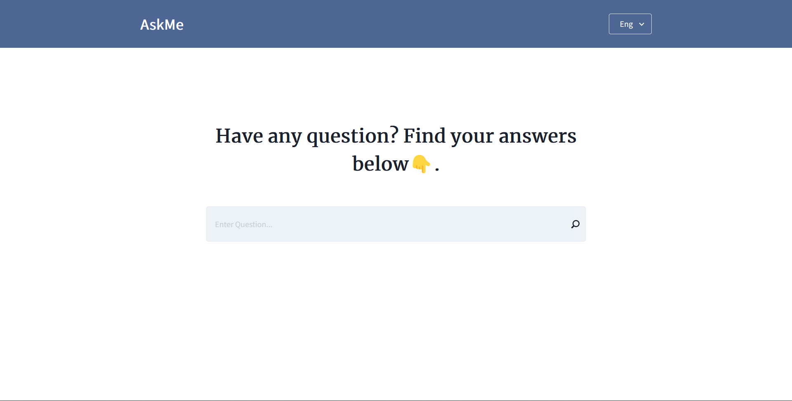

# AskMe



This is a simple web application which users can use in finding answers to any question they have.

## Technologies

- [Next.js](https://nextjs.org)
- [Chakra UI](https://chakra-ui.com)
- [Micro Answer REST API](https://m3o.com/answer)

## Getting Started

- Clone this repository into your local machine:

```git
git clone https://github.com/Young-Einstein10/jurata_assessment.git
```

- Install dependencies:

```git
yarn install or npm install
```

## Usage

- You will need to create an account on [Micro Answer REST API](https://m3o.com/answer) to get an API KEY which you then add to the `.env` file in the root folder like so.

```env
NEXT_PUBLIC_API_KEY=XXXXXXXXXXXXXXXXXXXXXXXXXXX
```

- To start the application:

```git
yarn dev or npm run dev
```

- Open [http://localhost:3000](http://localhost:3000) in your browser and type in aby question you have in the search bar.


## Deployment

The easiest way to deploy your Next.js app is to use the [Vercel Platform](https://vercel.com/new?utm_medium=default-template&filter=next.js&utm_source=create-next-app&utm_campaign=create-next-app-readme) from the creators of Next.js.

Check out [Next.js deployment documentation](https://nextjs.org/docs/deployment) for more details.

## Contributing

Pull requests are welcome. File an issue for ideas, conversation or feedback.

## Author

- Abdulrahman Yusuf

## License

- This project is licensed under the [MIT Public License](LICENSE)
